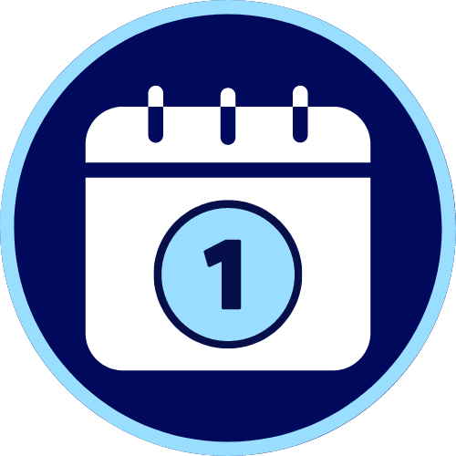
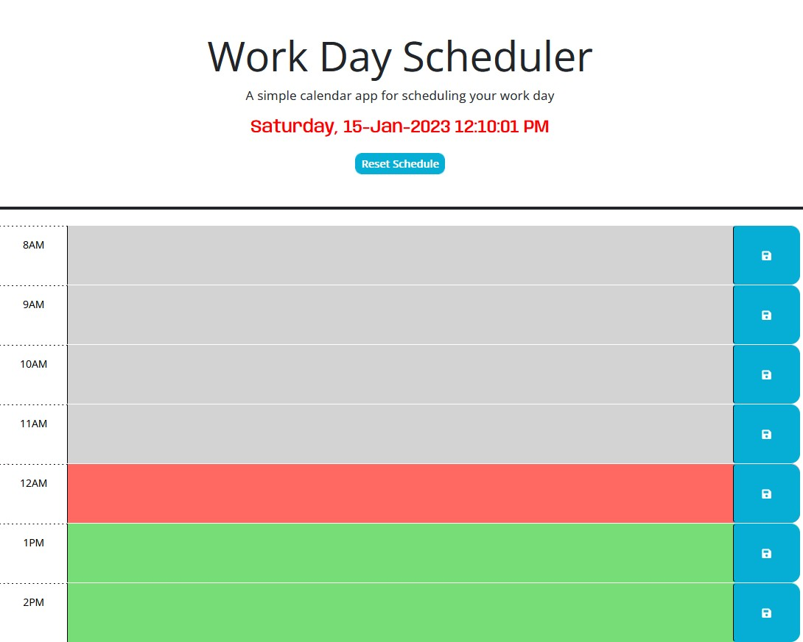
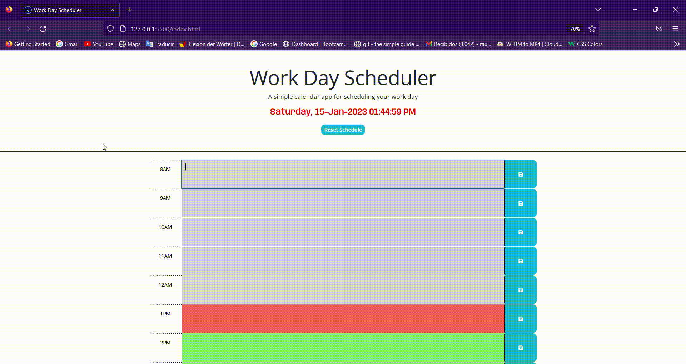

<!-- PROJECT LOGO -->
 

  

  <h2 align="center">Work Day Scheduler App</h2>
  <h4 align="center">Third Party APIs Project</h4>

  

  This project is focused on the use of Third Party APIs, such as Bootstrap, JQuery and Day.js. We use Bootstrap to give some predefined styles and responsiveness to our application, while JQuery and Day.js to provide functionality, and information.
     
     
    <a href="https://github.com/RaulMaya/Scheduler-App">Repository</a>    
    ·
    <a href="https://raulmaya.github.io/Scheduler-App/">Deployment</a>
    ·
    <a href="https://www.linkedin.com/in/raul-maya/">My LinkedIn</a>

  

<!-- ABOUT THE PROJECT -->

### About The Project
 

 The main goal of this application, is to help the user to organize its workday, having an schedule where they can enter their assignments, meetings and tasks. The application goes from 8:00 AM and ends at 5:00 PM (Since it is "Work Day").

 

The text area are diveded into different colors, gray for past activities, red for activites going on, and green for future tasks. At the side of every text area there is a blue area with a save icon. The user must need to click on the save icon to save their activities and prevent them to be erased.

 

### Contact :iphone:

- Name: Raul Maya Salazar
- Phone: +52 833 159 7006
- E-mail: raulmayas20@gmail.com
- GitHub: https://github.com/RaulMaya
- LinkedIn: https://www.linkedin.com/in/raul-maya/

(<a href="#top">back to top</a>)
